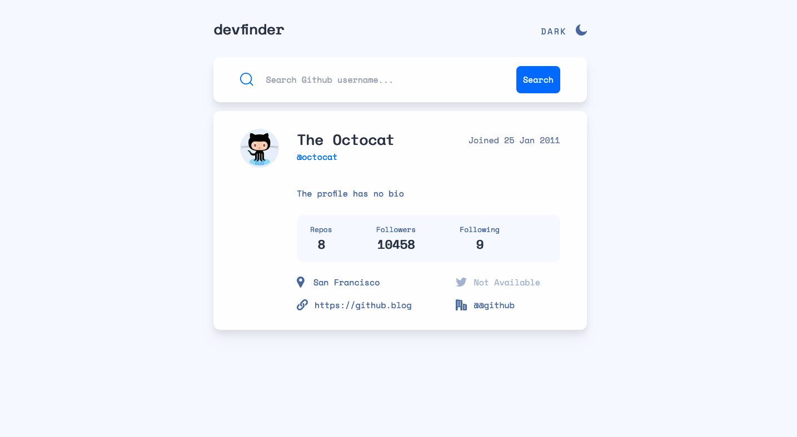

# Frontend Mentor - GitHub user search app solution

This is a solution to the [GitHub user search app challenge on Frontend Mentor](https://www.frontendmentor.io/challenges/github-user-search-app-Q09YOgaH6).

## Table of contents

-  [Overview](#overview)
   -  [The challenge](#the-challenge)
   -  [Screenshot](#screenshot)
   -  [Links](#links)
-  [My process](#my-process)
   -  [Built with](#built-with)
   -  [What I learned](#what-i-learned)
   -  [Continued development](#continued-development)
-  [Author](#author)

## Overview

### Requirements

Users should be able to:

-  View the optimal layout for the app depending on their device's screen size
-  See hover states for all interactive elements on the page
-  Search for GitHub users by their username
-  See relevant user information based on their search
-  Switch between light and dark themes
-  **Bonus**: Have the correct color scheme chosen for them based on their computer preferences. _Hint_: Research `prefers-color-scheme` in CSS.

### Screenshot

### Links

-  Solution URL: [Github Repository](https://github.com/jacksonwhiting/github-user-search-app)
-  Live Site URL: [Live Site](https://jw-github-user-search-app.netlify.app/)

## My process

### Built with

-  Semantic HTML5 markup
-  CSS custom properties
-  Flexbox
-  CSS Grid
-  Mobile-first workflow
-  Tailwind CSS
-  Vanilla Javascript

### What I learned

I had my second opportunity to work with a 3rd Party API. I looked for another way to get access to all of the DOM nodes I needed to update besides declaring a constant for each node.

As a solution, I gave them all a common class and then did a querySelectorAll to get access. Then I wrote a custom function to create an object where the key is the ID of each DOM node. Then used that object to target the nodes. This was just another way to skin the cat but I definitly learned something and will probably use it in the future when I have many DOM nodes to update (without using a templating framework).

Finally - this was my first time creating a dark mode. I found a nice function to work with to listen to the window object to detect the current mode set in the browser. Also made it user selectable.

### Continued development

I'd like to learn how to efficiently pull in lots of data and search through it (much like google). I'd also like learn how to paginate data.

## Author

-  Frontend Mentor - [@jacksonwhiting](https://www.frontendmentor.io/profile/jacksonwhiting)
-  Twitter - [@JWhiting00](https://www.twitter.com/JWhiting00)
